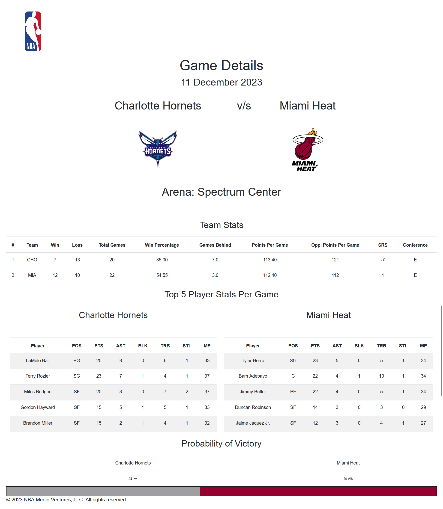
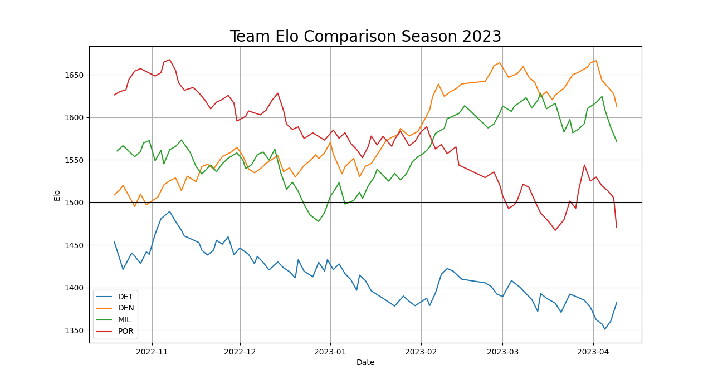

# Real-time NBA Data Analytics and Prediction System

### Summary

This repository holds the scripts that extract, transform and load the data website hosted by [Basketball Reference](https://www.basketball-reference.com/) to perform EDA and predict the outcome of games on a daily basis. 

## Table of Contents

- [Highlights](#features)
- [Installation](#installation)
- [Usage](#usage)


## Highlights

A dynamic and user-friendly front-end using Python Flask that provides real-time analytics for current NBA games. Users can interact with the interface to access statistics of the teams and players for ongoing NBA matches. 


*Landing Page*
---


*Game Page*
---



The user can navigate to the landing page and click on the `Details` which would redirect them to the `Game` page where they may view statistics about the team, the top players and probability of victory for each team which is calculated using the Logistic Regression Algorithm.

---

Performed EDA on the historical data to choose appropriate features for the prediction algorithm. 

For example:

Calculation of Elo for Teams in the 2023 Season



We see the downward trend of Portland Trail Blazers and the upward trend of Denver Nuggets that suggests in their performance trajectory in the league. 

---

## Installation

This project uses *Python 3.12.0* for building and *MySQL* for data storage.

Install MySQL [here](https://www.mysql.com/downloads/).

Install Python [here](https://www.python.org/downloads/).


Note: For all commands please keep the present working directory as the parent folder (NBA-Prediction-Model). 

#### Installing dependent libraries.

To install the necessary libraries please refer to the ```requirements.txt```.

Run the following commands.

```
pip install --upgrade pip
pip install -r requirements.txt
```

#### Uploading Data to MySQL database.

Create a database with the name of your choice. 

Upload the `data/raw.sql` to that database. 

```
cat data/raw.sql | mysql -u root -p `name of database`
```

Enter your password when you are prompted for it.

#### Configure `creds.json`

```
{
    'host': 'localhost',
    'user': 'root',
    'password': 'root',
    'database': 'nba'
}
```

Configure the credentials accordingly. 

## Usage

#### Getting Latest Data

In order to have the best possible prediction, it is preferred to have the latest data.

To obtain the most recent data (data up until the previous day's games), run the following command.

```
python processing/process.py
```

#### Use Flask App to view today's games.

```
python app/app.py
```

Use http://127.0.0.1:5000 to view the landing page for today's games.
